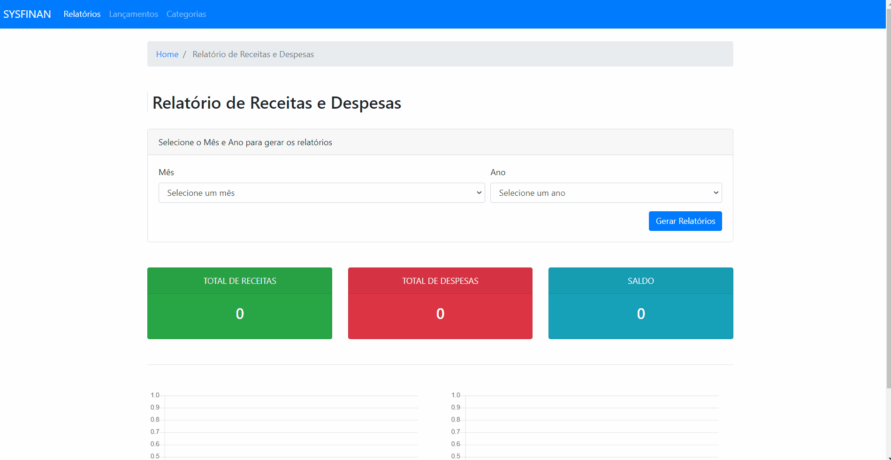
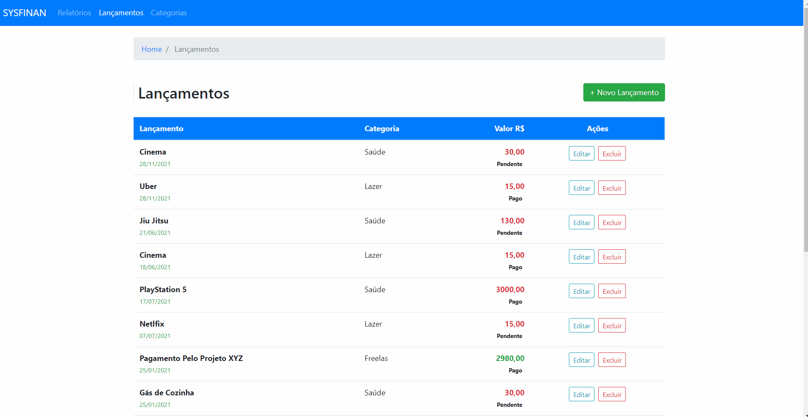

# sysFinans

This project was built with Angular 11, and simulates a finance system with registration of entries and categories, with demonstration of graphs of income and expenses and with research of this data by month and year.

PT_BR => Este projeto foi construído com o Angular 11, e simula uma sistema de finanças com cadastro de lançamentos e categorias, com demonstração de gráficos das receitas e despesas e com pesquisa desses dados por mês e ano.

## Initializing server

Run `ng s` at the terminal and browse to `http://localhost:4200/`.

## sysFinan in operation

  
  

## Technologies

PT_BR => Esse projeto foi desenvolvido com as seguintes tecnologias:  
EN => This project was developed with the following technologies:

- ✔️ HTML5

- ✔️ Javascript

- ✔️ Angular 11

- ✔️ In Memory Web API

